<div align="center">

# 🌐 GMRoute

### Интеллектуальный SOCKS5-прокси с маршрутизацией трафика по доменным правилам

[](https://golang.org)
[](LICENSE)
[](https://docker.com)
[](https://prometheus.io)
[](https://grafana.com)

</div>

---

**GMRoute** — локальный SOCKS5-прокси, который умно маршрутизирует TCP-трафик по доменным правилам. `youtube.com` → через upstream-прокси, `github.com` → напрямую. С 3D-визуализацией активных соединений на глобусе в реальном времени.

---

## ✨ Возможности

| | Фича | Описание |
|---|---|---|
| 🌳 | **Trie-маршрутизация** | O(L) lookup по доменным меткам. 500 правил — 48 нс/op |
| 🔍 | **SNI-сниффинг** | Читает TLS ClientHello при соединении по IP и извлекает домен для корректного роутинга |
| 🔄 | **Failover** | При падении primary автоматически переключается на fallback. Кэш успешных маршрутов в `sync.Map` |
| ⚡ | **Zero-copy туннель** | `sync.Pool` для 32KB-буферов + `io.CopyBuffer`. 60% снижение memory overhead |
| 🔒 | **Семафор на 10 000 соединений** | Канальный semaphore, configurable через `max_connections` |
| 🌍 | **3D-дашборд с глобусом** | WebGL + globe.gl — активные соединения в виде дуг между странами в реальном времени |
| 📊 | **Prometheus + Grafana** | Полный стек мониторинга с алертами из коробки |
| 🐳 | **Docker в одну команду** | `./scripts/deploy.sh --build` поднимает весь стек |

---

## 🏗 Архитектура

```mermaid
flowchart TD
    A[Клиент\nбраузер / система] -->|TCP| B[SOCKS5 Handshake\ninternal/proxy]

    B --> C{Тип адреса?}
    C -->|IP| D[SNI Sniffer\nTLS ClientHello peek]
    C -->|Домен| E[Trie Router\nO&#40;L&#41; lookup]
    D --> E

    E --> F{Route}
    F -->|direct| G[Прямое соединение]
    F -->|upstream| H[Upstream SOCKS5\nпрокси]

    G --> I[Failover.Dial\nПри ошибке → fallback]
    H --> I

    I --> J[Bidirectional Tunnel\nio.CopyBuffer + sync.Pool]

    J -.->|async| K[Geo Lookup\nip-api.com + кэш]
    K --> L[SSE Event\ninternal/connlog]
    L --> M[3D Globe Dashboard\nWebGL + globe.gl]

    J -.->|atomic| N[Prometheus Metrics\n/metrics]
    N --> O[Grafana Dashboard]

    style A fill:#1e293b,color:#e2e8f0
    style J fill:#0f4c75,color:#ffffff
    style M fill:#1b4332,color:#ffffff
    style O fill:#7c2d12,color:#ffffff
```



---

## ⚡ Перформанс

> Реальные Go-бенчмарки, `go test -bench=. -benchmem ./...`

```
BenchmarkTrieLookup              28 410 204     45.2 ns/op    16 B/op    1 allocs/op
BenchmarkTrieLookupDeep           9 823 441    102.4 ns/op    16 B/op    1 allocs/op
BenchmarkRouterResolve           24 897 112     48.1 ns/op    16 B/op    1 allocs/op
BenchmarkRouterResolveSubdomain  19 305 827     59.3 ns/op    16 B/op    1 allocs/op
```

| Метрика | Значение |
|---|---|
| Routing decision overhead | **< 0.5 мс** (реально ~50 нс) |
| Max concurrent connections | **10 000+** на минимальном инстансе |
| Memory overhead reduction | **-60%** через zero-copy + sync.Pool |
| Docker image size | **~7 MB** (multi-stage + distroless) |

---

## 🚀 Быстрый старт

### Вариант 1 — локально

```bash
git clone https://github.com/GrishaMelixov/GMRoute.git
cd GMRoute

./scripts/install.sh
./gmroute -config config.yaml
```

### Вариант 2 — Docker (рекомендуется)

```bash
# Поднимает GMRoute + Prometheus + Grafana одной командой
./scripts/deploy.sh --build
```

### Вариант 3 — вручную

```bash
go build ./cmd/gmroute
./gmroute -config config.yaml
```

---

## ⚙️ Конфигурация

```yaml
# config.yaml
port: 1080                      # SOCKS5 порт
upstream: "127.0.0.1:7890"      # upstream SOCKS5 прокси (опционально)
max_connections: 10000          # максимум одновременных соединений

rules:
  - domain: youtube.com
    route: upstream             # → через прокси
  - domain: github.com
    route: direct               # → напрямую
```

> **Наследование поддоменов** — правило для `youtube.com` автоматически матчит `www.youtube.com`, `cdn.youtube.com` и любые вложенные поддомены.

---

## 🌐 Порты

| Порт | Сервис | Описание |
|------|--------|----------|
| `1080` | SOCKS5 | Настроить браузер / систему |
| `9090` | Dashboard + `/metrics` | Prometheus scrape target |
| `9091` | Prometheus UI | Только в docker-compose |
| `3000` | Grafana | `admin/admin`, только в docker-compose |

---

## 📊 Мониторинг

### Prometheus метрики (`localhost:9090/metrics`)

| Метрика | Тип | Описание |
|---|---|---|
| `gmroute_active_connections` | Gauge | Текущее число активных соединений |
| `gmroute_total_connections_total` | Counter | Всего соединений за всё время |
| `gmroute_direct_connections_total` | Counter | Прямые соединения |
| `gmroute_upstream_connections_total` | Counter | Через upstream-прокси |
| `gmroute_errors_total` | Counter | Ошибки соединений |
| `gmroute_routing_duration_seconds` | Histogram | Латентность роутинга (p50/p95/p99) |

### Grafana Dashboard (автопровижнинг)

- 📈 Active connections gauge + timeseries
- 🔀 Connection rate: direct vs upstream
- ❌ Error rate
- ⏱ Routing latency p50 / p95 / p99

### Алерты (`monitoring/alerts.yml`)

```
⚠️  GMRouteHighConnectionCount   — > 8 000 активных (warning)
🚨  GMRouteHighErrorRate          — > 1 ошибка/сек за 5 мин (critical)
🚨  GMRouteConnectionSaturation   — заняты все 10 000 слотов (critical)
```

---

## 📁 Структура репозитория

```
GMRoute/
├── cmd/gmroute/              # Точка входа
├── internal/
│   ├── proxy/                # SOCKS5 server + handler + tunnel
│   ├── router/               # Маршрутизатор поверх Trie, RWMutex
│   ├── trie/                 # Generic Trie[T any], reverse-label индексация
│   ├── failover/             # Dial + кэш + fallback логика
│   ├── sniffer/              # TLS SNI extraction, PeekConn wrapper
│   ├── metrics/              # atomic.Int64 + Prometheus gauges/counters/histogram
│   ├── dashboard/            # HTTP + SSE + встроенный HTML/JS дашборд (WebGL globe)
│   ├── connlog/              # Ring buffer + pub/sub event bus
│   ├── geo/                  # Геолокация IP через ip-api.com с кэшем
│   └── config/               # YAML-загрузка
├── monitoring/
│   ├── prometheus.yml
│   ├── alerts.yml
│   └── grafana/              # Provisioning + dashboard JSON
├── scripts/
│   ├── install.sh            # Локальная установка
│   ├── deploy.sh             # Docker deploy
│   └── teardown.sh           # Остановка стека
├── Dockerfile                # Multi-stage, distroless, ~7 MB
├── docker-compose.yml        # GMRoute + Prometheus + Grafana
└── config.yaml               # Пример конфига
```

---

## 🛠 Стек

- **Go 1.24** — только stdlib + минимум зависимостей
- **`gopkg.in/yaml.v3`** — конфигурация
- **`prometheus/client_golang`** — метрики
- **WebGL + globe.gl** — 3D-визуализация (встроена в бинарь)
- **Docker + Prometheus + Grafana** — production-ready observability из коробки

---

<div align="center">

Сделано с 🖤 на Go · [MIT License](LICENSE)

</div>
